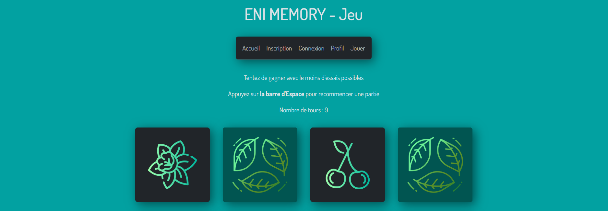
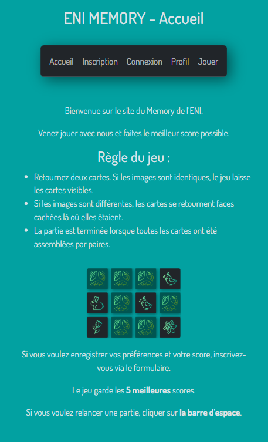
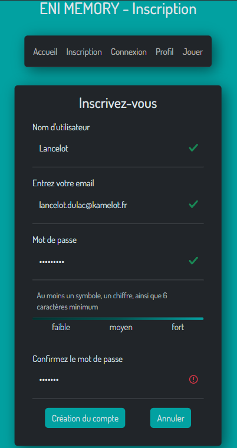
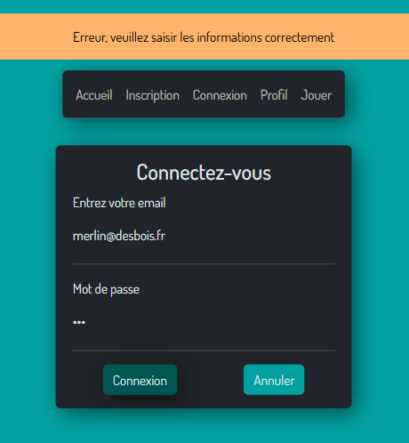
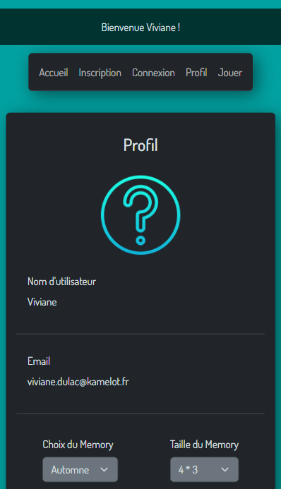
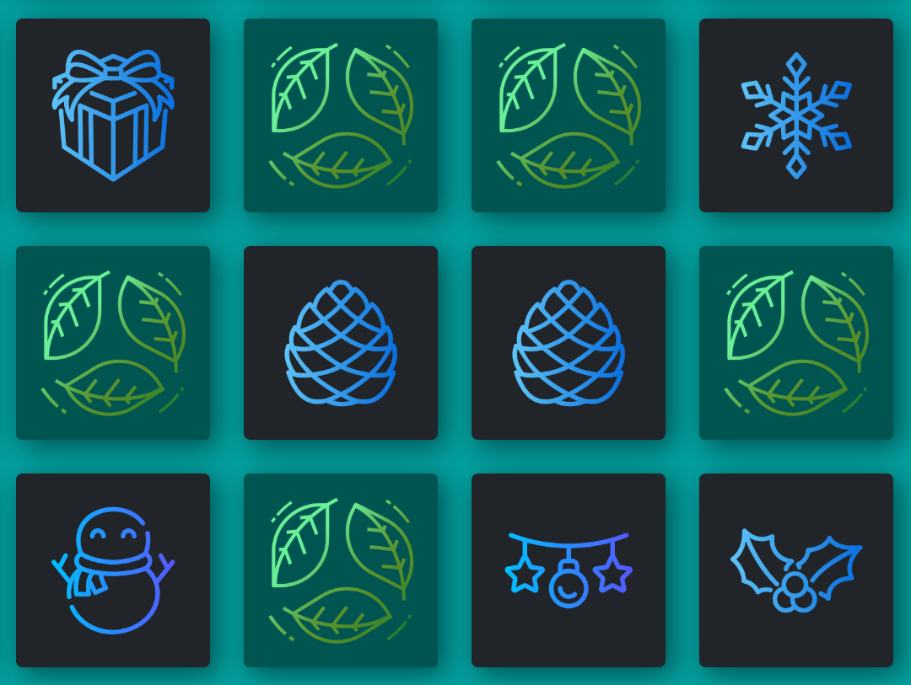
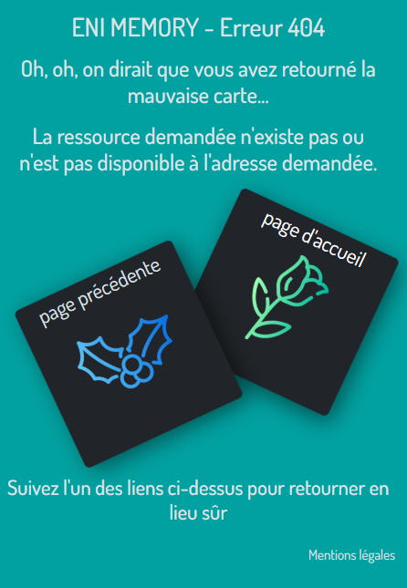

# Memory

Projet de memory Formation ENI Rennes 

## Aperçu

## A propos

Ce projet est réalisé dans le cadre de la formation "Développeur Web et Web Mobile" de l'ENI de Rennes.
🔗 <a href="https://MathildeGuedon.github.io/memorySaisons" target="_blank" rel="noopener noreferrer">Voir le site en ligne</a>

## Fonctionnalités

- **Mobile first** : Site conçu pour une utilisation sur support mobile d'abord
- **Design responsive** : Expérience fluide quel que soit le support : mobile, tablette ou ordinateur.
- **Mémorisation en local** : Sauvegarde des comptes et des scores dans le localStorage.
- **Formulaire contrôlé** : Vérification de la validité des champs (nombre de caractères minimum, format de l'adresse mail, présence de caractères particuliers) au fur et à mesure de la saisie par l'utilisateur.
- **Affichage dynamique** : jauge affichant la difficulté du mot de passe, tableau des scores
- **Messages flash** : messages personnalisés s'affichant à l'inscription et à la connexion

## Technologies utilisées

- HTML 5, CSS 3
- Bootstrap
- JavaScript
- jQuery
- Illustrations : téléchargées sur Freepik

## Objectifs pédagogiques

Ce projet m'a permis de :

- Utiliser un **framework CSS** et une **librairie JavaScript**
- Concevoir une architecture **Mobile First** et **Responsive**
- Travailler l'**accessibilité** du site (textes alternatifs des images, Placeholder du formulaire)
- Gérer les **événements utilisateur**, la validation de formulaire contrôlé, le parcours utilisateur
- Fluidifier l'**expérience utilisateur** (stabilité de la page au chargement, effet au survol des liens, boutons d'appel à l'action, redirection automatique lors de la connexion)

## Captures d'écran

### Page d'accueil mobile first

### Formulaire d'inscription contrôlé

### Formulaire de connexion contrôlé

### Message de bienvenue personnalisé

### Choix des paramètres de jeu et affichage des scores du joueur

### Plateau de jeu

### Page 404

## Améliorations futures

- mise en place d'un chronomètre
- mise en place d'un compte à rebours
- hachage des mots de passe
- mode multijoueurs
- personnalisation de la photo de profil
- thèmes cachés disponibles seulement à Noël ou Pâques par exemple

## Contact

Mathilde Guédon - mathilde2.guedon@hotmail.fr - 
<a href="https://www.linkedin.com/in/mathilde-guédon-a08a08369" target="_blank" rel="noopener noreferrer">LinkedIn</a>
